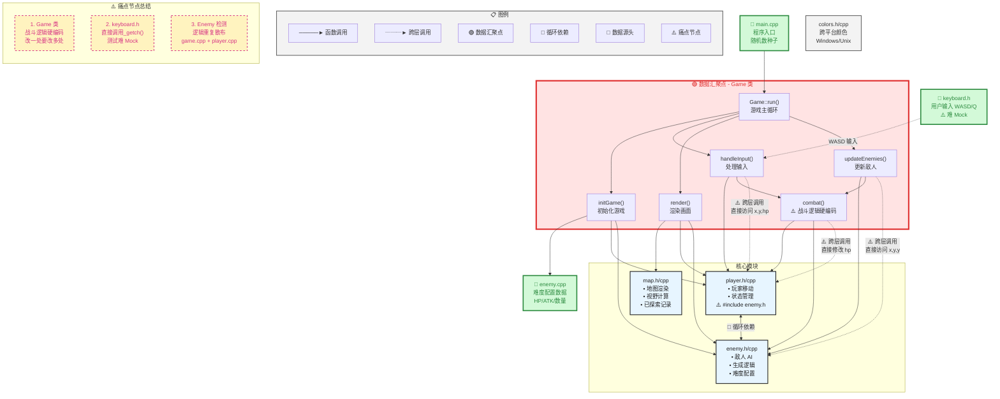
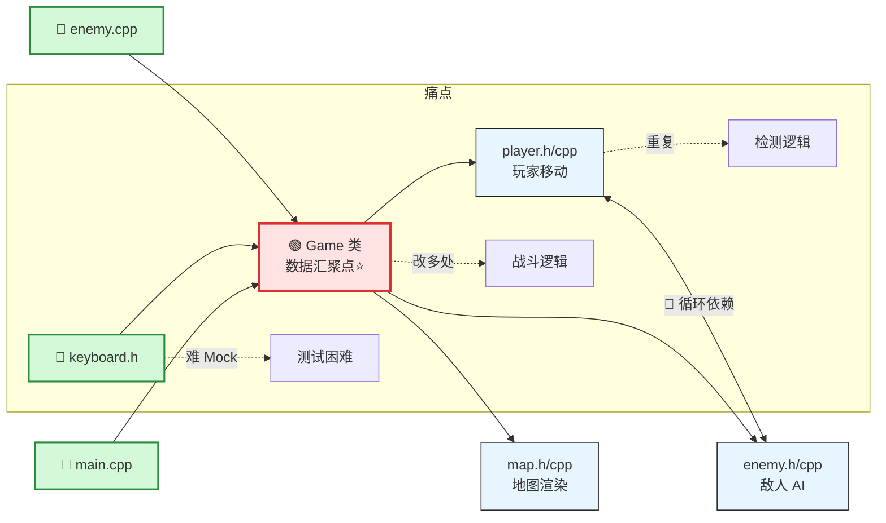
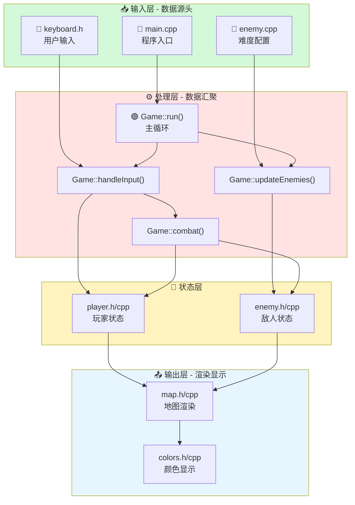
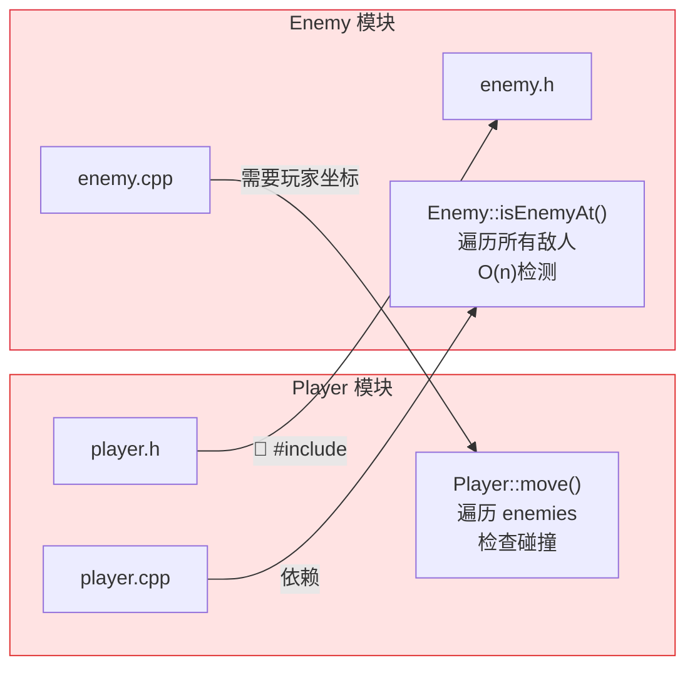
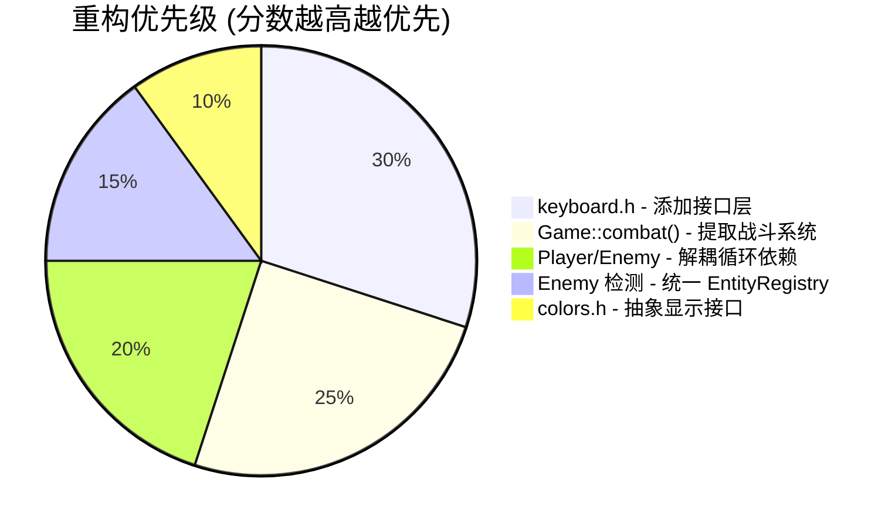

# 🎮 Sprint 项目架构图 - Mermaid 版本

## 1. 完整架构图 (带标注)



---

## 2. 简化版架构图 (适合快速查看)



---

## 3. 数据流向图



---

## 4. 循环依赖详解图



---

## 5. 痛点节点鱼骨图

```mermaid
mindmap
  root((⚠️ 痛点节点))
    改一处改多处
      Game::combat()
        玩家先手逻辑
        敌人先手逻辑
        代码重复
      添加新武器
        改 combat()
        改 damage 计算
        改 UI 显示
    测试难 Mock
      keyboard.h
        直接调用_getch()
        无法注入测试
        需要真实输入
      Colors 类
        平台相关代码
        难以模拟输出
    逻辑重复散布
      敌人检测
        game.cpp
        player.cpp
        enemy.cpp
      碰撞检测
        Player::move()
        Enemy::moveTowardsPlayer()
```

---

## 📊 模块统计表格

| 模块名 | 类型 | 被依赖数 | 痛点等级 | 说明 |
|--------|------|---------|---------|------|
| main.cpp | 💾 数据源头 | 0 | - | 程序入口 |
| keyboard.h | 💾 数据源头 | 1 | 🔴🔴🔴 | 难 Mock |
| game.h/cpp | 🟢 数据汇聚点 | 5 | 🔴🔴🔴 | 逻辑重复 |
| map.h/cpp | 核心模块 | 3 | - | 渲染系统 |
| player.h/cpp | 核心模块 | 2 | 🔴🔴 | 循环依赖 |
| enemy.h/cpp | 核心模块 | 3 | 🔴🔴 | 循环依赖 + O(n) |
| colors.h/cpp | 工具模块 | 2 | 🔴 | 平台相关 |

---

## 🎯 重构优先级



---

## 💡 改进建议

1. **创建 `IInputProvider` 接口**
   ```cpp
   class IInputProvider {
   public:
       virtual char getInput() = 0;
   };
   ```

2. **提取 `CombatSystem` 类**
   ```cpp
   class CombatSystem {
   public:
       CombatResult resolve(Player& p, Enemy& e);
   };
   ```

3. **创建 `EntityRegistry` 管理实体**
   ```cpp
   class EntityRegistry {
   public:
       bool isOccupied(int x, int y) const;
   };
   ```

---

**使用方法：**
- 在 VS Code 中安装 `Markdown Preview Mermaid Support` 插件
- 或在 https://mermaid.live/ 在线查看
- 或在 GitHub/GitLab 中直接渲染
